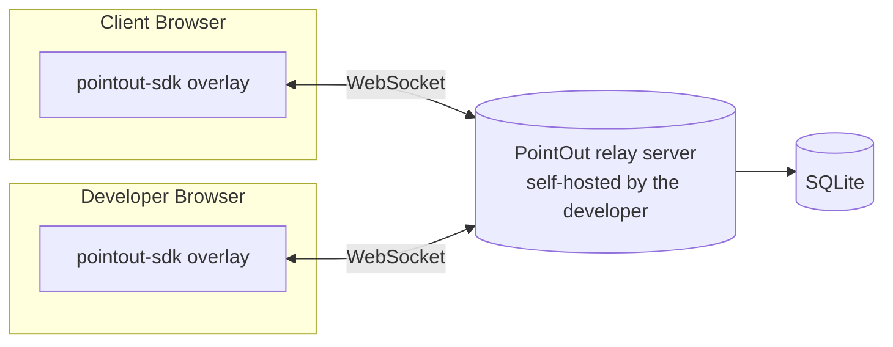

# PointOut

**Point it out, don't type it out.** PointOut is a free, open-source overlay widget that lets clients leave visual feedback — pins, circles, arrows, freehand sketches, notes — directly on a live demo website, synced in real time to the developer. No more "it's the button, kind of on the left, near the logo, on my phone but not desktop" over Messenger.

Built for freelancers and small studios who demo work-in-progress sites to clients and are tired of feedback getting lost across email threads, screenshots, and voice notes.

## Why

- **One shared surface.** Client and developer see the exact same annotations, live, on the exact same page.
- **Zero lock-in.** MIT licensed, framework-agnostic, self-hosted. Drop it into any project you already deploy.
- **Works anywhere.** A single `<script>` tag is enough — plain HTML, WordPress, Wix, Webflow, React, Vue, whatever the client's demo happens to run on.
- **Kill switch.** Turn the overlay off remotely the moment the project ships — no code changes needed on the demo site itself.

## How it works



1. The developer deploys the demo site however they normally would (VPS, Vercel, Wix, anything — completely unchanged).
2. They also run the lightweight **PointOut relay server** (`packages/server`) somewhere — a $5 VPS, a free Render/Railway instance, or their own infra. One relay can serve every client project they run, distinguished by a `project` id.
3. They add the **PointOut SDK** (`packages/core`) to the demo page with a couple of config lines pointing at that relay.
4. Both the client and the developer now see and create the same annotations live, from any device, regardless of what platform hosts the demo site itself.

## Packages

| Package | Description |
| --- | --- |
| [`packages/core`](packages/core) | `pointout-sdk` — the browser widget (toolbar, drawing tools, overlay rendering). Ships as ESM/CJS/IIFE, zero required build tooling for consumers. |
| [`packages/server`](packages/server) | `pointout-server` — self-hostable Node.js relay (WebSocket + REST) with SQLite persistence, Docker-ready. |
| [`examples/plain-html`](examples/plain-html) | Minimal two-page example (client + developer view) showing live sync. |

## Quick start

```bash
npm install
npm run build --workspace packages/core     # builds packages/core/dist/*

cd packages/server
cp .env.example .env                        # set POINTOUT_API_KEY
npm install
npm run dev                                  # relay running on :8787
```

Then, on the demo site:

```html
<script src="https://unpkg.com/pointout-sdk/dist/pointout.iife.js"></script>
<script>
  PointOut.init({
    project: 'acme-redesign',
    server: 'https://your-relay.example.com', // or ws://localhost:8787 while testing
    token: 'your-shared-secret',
    user: { name: 'Jane', role: 'client' },   // role: 'developer' on your own view
  });
</script>
```

No backend yet? Drop `server`/`token` entirely and PointOut runs in `local` mode, persisting to `localStorage` — perfect for a quick local trial. See [examples/plain-html](examples/plain-html) for a full working pair of pages.

For the full config reference, framework-specific snippets (React, Vue, WordPress, Wix, Webflow) and a production checklist, see the **[Integration guide](docs/INTEGRATION.md)**.

## Features (v0.1)

- Tools: select/move, pin + comment, rectangle/circle-an-area, arrow, freehand pen, text label.
- Every annotation carries an author name/role, timestamp, and an optional message.
- Developers can mark feedback **resolved** or delete it; clients can edit/delete their own notes.
- Overlay-wide **show/hide**, toggleable by either side, persisted per project.
- Real-time sync over WebSocket, with automatic reconnect; annotations persist in SQLite so late joiners see full history.

## Roadmap ideas

- Anchoring annotations to DOM elements (not just page coordinates) for better resilience across responsive breakpoints.
- Threaded replies per annotation.
- Screenshot/element picker tool.
- Dashboard app for developers managing multiple client projects at once.
- Optional pluggable transports (Supabase/Firebase/Pusher) for teams that don't want to run `packages/server` themselves.

Contributions and idea discussions are very welcome — open an issue or a PR.

## Support the project

PointOut is free and MIT-licensed. If it saves you time, consider supporting development via GitHub Sponsors / Ko-fi / Patreon (links on the repo's GitHub page).

## License

MIT © PointOut Contributors — see [LICENSE](LICENSE).
